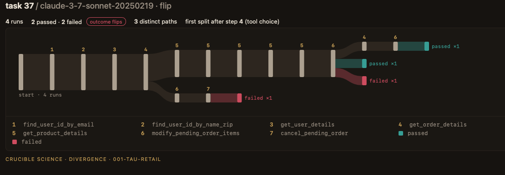

# 001 · Same customer, same request, four runs, two outcomes

Where a customer-service agent's repeated runs of the same request split, and when the
split decides the outcome. 216 published runs from Sierra's τ²-bench retail benchmark,
read without making any model calls.

**[Read the note →](NOTE.md)** · Crucible Science · October 2026 · tag `001-tau-retail-v1`



*Task 37 on Claude 3.7 Sonnet. Runs #2 and #3 make the same ten tool calls in the same
order; one passes, one fails. [The two runs side by side.](exhibits/task37_pair.md)*

## In three numbers

- **10 of 15** tasks flipped between pass and fail across four identical runs on Claude 3.7
  Sonnet, and **7 of 15** on o4-mini. The tasks were chosen for instability; across all
  114 tasks the rates are 33% and 46%.
- **1 argument**: in task 37, two runs shared every tool call, and one wrote a T-shirt
  19 cents more than the cheapest it had just looked up, while telling the customer it
  had found the cheapest.
- **About 7x**: in task 50, every run succeeded, and the most expensive cost about seven times
  the cheapest.

Of five pre-registered hypotheses, one failed. The note reports each against its bar.

## What is in this folder

| File | What it is |
|---|---|
| [`NOTE.md`](NOTE.md) | The note |
| [`experiment.yaml`](experiment.yaml) | Hypotheses, thresholds and task-selection rule, written before the confirmation models were scored |
| `analysis.json` | Every number the analysis computed, per cell and per run |
| `validity.json` | The task check against the current benchmark (task 18 excluded) |
| `manifest.json` | Source files, commits and sha256 of every input |
| `runs/` | 216 runs as OpenTelemetry JSON traces, one file per run |
| [`exhibits/`](exhibits/) | The trajectory-tree images and the task 37 side-by-side excerpt |
| `fetch_raw.sh` | Downloads Sierra's raw results at commit 5bfa7e37 and checks their hashes |
| `checks.sh` | Recomputes the numbers in the note that are not in `analysis.json` |

## See the trajectory trees

From the repository root:

```
python -m http.server
```

Then open `http://localhost:8000/viewer/?exp=001-tau-retail`. Every task and model is
browsable; click two runs to compare them step by step. Nothing leaves your machine.

## Reproduce it

From the repository root, at tag `001-tau-retail-v1`:

```
bash experiments/001-tau-retail/fetch_raw.sh
python divergence/importers/tau.py experiments/001-tau-retail --clean
python divergence/analyse.py experiments/001-tau-retail
bash experiments/001-tau-retail/checks.sh
```

## Sources and licences

The runs and their grades are Sierra's, from
[τ²-bench](https://github.com/sierra-research/tau2-bench) (MIT licence), retail baseline
results at commit 5bfa7e37. The note is CC BY 4.0; the code is MIT.

Crucible Science sells this analysis applied to a client's own agent. This study was
self-funded; no vendor paid for it, saw it before publication, or reviewed it.
Contact: ashwin@cruciblescience.com