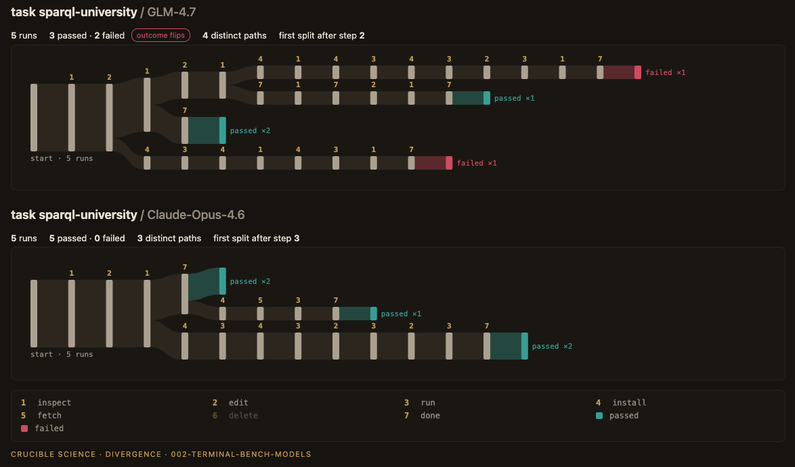

# Same task, cheaper model, five runs

*How many dependable tasks stayed dependable, how often a run stopped and was wrong, and what a finished task cost.*

Crucible Science

*Crucible Science sells this analysis applied to a client's own agent. This note was self-funded and no vendor saw it before publication.*

**In short.** We read 4,005 published trials from the Terminal-Bench 2.0 leaderboard without running any model ourselves: one harness with five models, and one model in five harnesses, on 89 coding tasks in a terminal, five trials each. The numbers below are for the 61 tasks not on Terminal-Bench 2.1's list of revised tasks.

- **Dependable tasks.** Claude Opus 4.6 passed 33 tasks on all five trials. On the same harness, three of the four cheaper models passed 11 to 14 of those 33 every time, and GLM-5 passed 20. Most of the rest became unreliable; they did not fail outright (for DeepSeek V3.2, 13 of 21).
- **Stopped, but wrong.** Of the runs that stopped by themselves, 14% had failed on Opus and 26% to 46% on the cheaper models: two to three times as often on three of the four (3.2x, 2.8x, 2.8x).
- **Cost.** In recorded dollars, DeepSeek V3.2 cost 18.6 times less than Opus per run and 11.6 times less per finished task. The saving shrinks with the runs that fail. GLM-4.7 and Kimi K2.5 are priced about eight times below Opus per input token and come out about twice as cheap per finished task, by our estimate at list prices with caching assumed.
- **Harness.** With Opus 4.6 in five different harnesses, every one still passed some trials and failed others on a quarter or more of the tasks (26% to 39%).
- **One task, read closely.** On one task, two of GLM-4.7's five runs wrote a query that lists only a professor's EU countries, where the task asks for all of them. Both ran it on the data they could see, reported it verified, and failed. The other three kept every country and passed. Opus's runs that tested their query passed, so this is one illustration, not a rate.
- We wrote down eight claims in public before reading any outcome in these trials. Seven hold on the 61 tasks and on all 89. The eighth, about harnesses, is met only at its threshold on the 61 and not on all 89. The bars were modest; the sizes and intervals carry the findings. All data and code are public.



*Five runs of one task on each model: GLM-4.7 above (three passed, two failed), Claude Opus 4.6 below (five passed), both on Terminus2. A number names the kind of step, as in the key; the order of steps runs left to right. This pair is an illustration, chosen for readability; most task and model pairs are messier.*

## 1. Why a model switch needs its own test

Teams change the model under a working agent for ordinary reasons: a cheaper one arrives, a provider retires a version, a contract ends. The usual check is a score, the new model's pass rate beside the old one's. A score cannot say which tasks moved. A task the agent passed every time may now pass three times in five, and the score shows that only as a few points.

Note one found, on a customer-service benchmark with 2025 models, that the same request handled four times did not end the same way on a third to nearly half of the tasks [1]. This note takes the next question to newer models and a different kind of work. When the harness stays the same and the model under it changes, which of the dependable tasks stay dependable, how often does a run stop by itself and turn out wrong, and what does a finished task cost? It then asks the same when the model stays and the harness changes.

The question is becoming a regulatory one too. RBI's draft guidance on model risk management asks that "any change to a model, should be preceded by a documented impact assessment" (para 40) [2].

## 2. What we looked at, and how to read it

The runs are not ours. Submissions to the Terminal-Bench 2.0 leaderboard are published in a public dataset, `harborframework/terminal-bench-2-leaderboard` (Apache 2.0) [3]. We used revision 572b2614: 89 tasks, five trials per task per submission, each with the verifier's recorded result and, where the harness writes one, a step-by-step log. We ran no model and used the recorded results as they stand.

A *harness* is the program around the model: it hands the model its tools, runs its commands and decides when a run ends. A *trial*, or run, is one attempt at one task.

There are two comparisons of five submissions each. In the first the harness is Terminus2 throughout, and Claude Opus 4.6 is the reference for four cheaper models: DeepSeek V3.2, GLM-4.7, Kimi K2.5 and GLM-5. We hold list prices for the first three; GLM-5's price is not in our data. In the second every submission names Opus 4.6 as its model and the harness differs: Judy, Meta-Harness, Terminus2, Terminus-KIRA and WozCode. Opus 4.6 on Terminus2 is in both, so the note rests on 4,005 trials, 3,988 of them with a step log. Only harnesses that publish a structured step log could be included (section 6).

The cheaper models were not picked from a longer list. The five are every submission filed under `Terminus2` in the dataset at this revision, other than the two reference models (Opus 4.6 here, GPT-5.3-Codex in exploration). MiniMax M2.5 was set aside for exploration before any cheaper-model trial was read, and the other four are the confirmation set. One more submission is filed under a differently spelled harness name (`terminus-2__AfterQuery-GPT-OSS-20B`); it was not part of the split fixed on 2 October and is not analysed here.

More than the model differs between these submissions. A "model" here is the model as its submitter configured and served it, and the trial configs record this:

| Model | Served through | Reasoning effort | Temperature | Run dates, 2026 |
|---|---|---|---|---|
| Claude Opus 4.6 | Anthropic's API | high | 1 | 6 Feb |
| DeepSeek V3.2 | DeepSeek's `deepseek-chat` alias | not set | not set | 7 to 8 Feb |
| GLM-4.7 | Ollama cloud | high | not set | 26 to 27 Jan |
| Kimi K2.5 | Ollama cloud | not set | not set | 27 to 28 Jan |
| GLM-5 | a private endpoint, with a different response parser | not set | 0.7 | 14 Feb |

So a difference between two rows is a difference between two submissions, not between two models in isolation. GLM-5 is counted, flagged, and every verdict is shown with and without it.

Terminal-Bench 2.1 later fixed issues in 28 of the 89 tasks [4]. Our primary scope is the 61 tasks not on that list, where verdicts are decided; the reports give every number for all 89 as well. The list of 28 is Terminal-Bench's own (section 6).

Before reading any outcome in these trials we wrote down eight claims with thresholds, after exploring on other submissions (GPT-5.3-Codex and MiniMax M2.5). The record is `prereg/002-terminal-bench.yaml` in the public repository. GitHub's event log shows it was pushed at 11:01 UTC on 2 October 2026, and our first import of the confirmation trials is stamped 11:06 UTC. The first time is GitHub's; the second comes from our own machine. By then we had seen, for the confirmation submissions, their file counts and sizes, their settings, whether tokens and cost were recorded, which tools appear and in what share of calls, and the step and tool-call counts of three sample logs from each Opus 4.6 harness. We had not seen their outcomes, or the step counts or token totals of a whole submission. Each submission's leaderboard score was public throughout.

A trial passes when the verifier's recorded reward is 1.0 or more. For one submission, a task is passed *every time*, *sometimes* or *never* across its five trials, and it *flips* when its logged trials include both a pass and a fail. A run *stopped by itself* when no timeout or error is recorded for it. A *finished* task is a run that passed, and the cost per finished task is everything a submission spent, failed runs included, divided by its runs that passed. Every trial counts in the outcomes, including the 17 with no step log. Input size is estimated the same way for every model: the characters in the log before each model call, divided by four.

The trees are built differently from note one's. Terminus2 gives the agent a shell and a call to declare the task done, so tool names would show nothing. Each tool call is labelled instead by the kind of action its command performs (inspect, edit, run, install, fetch, delete or done), and consecutive repeats are collapsed into one step. Waits and bare keystrokes are recorded but left out of the path. A call that does several things takes one label; section 6 says how often that hides something.

**The eight claims.** M1 to M4 must hold for at least three of the four cheaper models, M5 for all five models, and H1 and H2 for at least four of the five harnesses. Model figures run in the order DeepSeek V3.2, GLM-4.7, Kimi K2.5, GLM-5.

| | Claim, as registered | On the 61 tasks | On all 89 |
|---|---|---|---|
| M1 | A cheaper model passes every time on fewer than 60% of the tasks Opus passes every time | 36%, 33%, 42%, 61%: holds for 3 | holds for 3 |
| M2 | Of the tasks it does not hold, at least half still pass sometimes | 62%, 73%, 84%, 92%: holds for 4 | holds for 4 |
| M3 | Runs that stop by themselves fail at least 1.5 times as often as on Opus, and at least 5 points more | 3.23x, 2.77x, 2.83x, 1.85x: holds for 4 | holds for 3 (GLM-5 1.34x) |
| M4 | Input per finished task is at least twice Opus's, by the log estimate | several times (6.29x to 10.19x): holds for 4 | holds for 4 |
| M5 | In every model, at least 40% of the tasks whose runs all ended the same way show a twofold gap in input between runs | 59% to 85%: holds for 5 | holds for 5 |
| H1 | At least 10% of tasks flip | 26% to 39%: holds for 5 | holds for 5 |
| H2 | At least 8% of runs that stop by themselves fail | 8% to 15%: holds for 4 (Terminus-KIRA 7.95%) | holds for 5 |
| H3 | Across the harnesses, the highest rate is at least 1.5 times the lowest, for flips and for stopped-but-failed | 1.50x and 1.94x: met, at the threshold | 1.35x and 1.70x: not met |

Seven of the eight hold on both scopes; H3 is met exactly at its threshold on the 61 and not on all 89. The bars were modest: each was set looser than what exploration had shown (M3's is 1.5x, where exploration showed 2.4x), so clearing them says little by itself. The sizes and intervals below carry the findings. Every share has a 90% interval in `reports/intervals.txt`; the note prints only some.

## 3. Findings: the model changed

### 3.1 Which tasks stayed dependable (M1, M2)

On the 61 primary-scope tasks, Opus 4.6 on Terminus2 passed 33 on all five trials. These are the tasks a team would call dependable. The question is what happens to them when a cheaper model takes Opus's place in the same harness.

| Of the 33 tasks Opus 4.6 passed every time | DeepSeek V3.2 | GLM-4.7 | Kimi K2.5 | GLM-5 |
|---|---|---|---|---|
| still passed every time | 12 (36%) | 11 (33%) | 14 (42%) | 20 (61%) |
| passed sometimes (one to four of five trials) | 13 | 16 | 16 | 12 |
| never passed | 8 | 6 | 3 | 1 |

Three of the four cheaper models held a third to two-fifths of these tasks (90% intervals from about 21% to 57%). GLM-5 held 61% (47% to 75%), one task over the registered line.

Most of the tasks that were not held became unreliable; they did not break outright. The share that still passed sometimes was 13 of 21 on DeepSeek V3.2 (62%; 44% to 80%), 16 of 22 on GLM-4.7, 16 of 19 on Kimi K2.5 and 12 of 13 on GLM-5. DeepSeek is the weakest case: its interval reaches below half.

**A baseline.** Picking the 33 on Opus's own five passes guarantees some loss for any other set of runs, a second set of Opus runs included. We have no second set on Terminus2. The nearest thing in this data is Opus 4.6 in the other four harnesses, which passed 27 to 32 of the same 33 every time (section 4). That is not Opus re-run on Terminus2: those harnesses differ, and they pass more trials overall. Against it, the cheaper models passed 11 to 20.

A pass rate does not show any of this. Across all trials Opus passed 75% and the cheaper models 39% to 61%, and every model flipped on a similar share of tasks (36% to 46%). What the single number hides is which tasks moved from every time to sometimes. The movement is not all one way: DeepSeek V3.2 passed 18 tasks every time and Opus passed 12 of those every time; for GLM-5 the figures are 24 and 20. The full table for each pair is in section 8 of `reports/harbor_import_models_confirmation.txt`.

### 3.2 Stopped, but wrong (M3)

A timeout is visible to whoever runs the agent. A run that ends on its own and is wrong is not, until something downstream fails. We count a run as having stopped by itself when no timeout or error is recorded for it.

| | Opus 4.6 | DeepSeek V3.2 | GLM-4.7 | Kimi K2.5 | GLM-5 |
|---|---|---|---|---|---|
| Runs that stopped by themselves | 260 | 259 | 195 | 236 | 243 |
| of which failed | 37 (14%) | 119 (46%) | 77 (39%) | 95 (40%) | 64 (26%) |
| Rate against Opus's, with 90% interval | – | 3.23x (2.30 to 4.97) | 2.77x (1.99 to 4.22) | 2.83x (2.13 to 4.14) | 1.85x (1.33 to 2.70) |
| Trials that timed out, of 305 | 45 | 45 | 96 | 62 | 62 |

On Opus, 14% of the runs that stopped by themselves had failed (90% interval 9% to 20%). On DeepSeek V3.2, GLM-4.7 and Kimi K2.5 the rate was two to three times that, with every lower bound at about 2.0x or more, and on GLM-5 nearly twice. Counting only runs that made an explicit call to mark the task complete gives the same picture: 15% on Opus and 28% to 47% on the others.

Timeouts do not explain the gap. DeepSeek V3.2 timed out on 45 of 305 trials, the same number as Opus, yet failed 87 more trials, and the difference in runs that stopped by themselves and failed is 82. GLM-4.7 is different: it timed out about twice as often, so fewer of its runs stopped by themselves at all. A timeout depends partly on how fast a model is served, so we do not read GLM-4.7's timeouts as a property of the model.

### 3.3 One task, read closely

The trees at the top of this note show one task, `sparql-university`. It gives the agent a data file about universities and asks for one query: the full professors who work in at least one department of a university in an EU country, and in at least one department with more than ten current students, each with "all countries where the professor currently works in". Opus 4.6 passed it five times out of five. GLM-4.7 passed three of five, and the other three cheaper models were unreliable on it too.

The five GLM-4.7 runs wrote two kinds of query. In two, the country that is listed is the same variable that is filtered to the EU codes, so a professor who also works outside the EU is listed with EU countries only. In the other three, and in all five of Opus's, every country is kept. On the data the agent could see, the second kind returns "GR, US" for one professor where the first returns "GR".

The two runs with the first kind installed a library, ran the query on the data file, and got three professors back, with the one who also works in the US listed under GR only. Both reported the query verified, and both failed. Run 000 had the difference on its own screen: one step after its test it printed a list showing him under both GR and US, and it did not change the query. The three runs with the second kind looked for a query tool, installed nothing, declared the task done without running their query, and passed. [The queries, the terminal output and every run are side by side here.](exhibits/sparql_university_pair.md)

Three of Opus's five runs also tested their query, and they passed. So this is not evidence that testing causes failure, and five runs give no rate. What the two failing runs have in common is the kind of query, not the test. The pair shows something narrower: a test the agent writes for itself checks the query against the agent's own reading of the task, and here it agreed with the query both times.

The verifier runs each query on a test graph the agent never sees, which we do not republish; re-running its comparison on the ten final queries reproduces all ten recorded results. We picked this pair by hand, for readability, from the top 12 of a mechanical shortlist of 30 task and model pairs; it is rank 8. In 24 of the 30, this pair among them, neither the passing nor the failing runs keep to one path. This one is readable because it is short: 15 steps at most, where 23 of the 30 have a run of 30 steps or more.

### 3.4 What a finished task costs (M4, M5)

A cheaper model is chosen for the bill. Two things in these runs work against its price per token: it reads more per finished task, and more of its runs fail.

**Input.** Per finished task, counting the input of failed runs too, each cheaper model read several times what Opus did. By our log estimate the figure is 6.3x to 10.2x, with wide intervals (DeepSeek V3.2: 7.3x, from 3.8x to 13.9x). The providers' own token counts, where they are usable, agree (5.4x, 6.3x and 8.5x; GLM-5 recorded none).

**Dollars.** Only Opus and DeepSeek have a dollar cost in their logs. A recorded dollar is the cost the harness logged for a trial, not an invoice; tokens times list price reproduce it exactly for DeepSeek and within 4% for Opus. For GLM-4.7 and Kimi K2.5 we did that multiplication ourselves, as a range: 95% of input at the cached price, or none of it. Their logs record no cached tokens, so the with-caching figure is what the maker's own API would charge at that cache rate, not what happened in these runs or what the submitters paid. Kimi's price is from a secondary source (section 6).

| Per finished task | With caching | Opus ÷ model | Without caching (all estimates) | Opus ÷ model |
|---|---|---|---|---|
| Opus 4.6 | $0.80 recorded | – | $1.93 | – |
| DeepSeek V3.2 | $0.07 recorded | 11.6x (7.1 to 18.1) | $0.45 | 4.3x (2.3 to 7.8) |
| GLM-4.7 | $0.37 estimate | 2.1x (1.5 to 3.1) | $1.22 | 1.6x (1.0 to 2.3) |
| Kimi K2.5 | $0.43 estimate | 1.9x (1.4 to 2.5) | $1.58 | 1.2x (0.9 to 1.7) |

DeepSeek V3.2 cost 18.6 times less than Opus per run (12.2x to 27.4x) and 11.6 times less per finished task, in recorded dollars. The gap between the two figures is the pass rate, 47% against 75%. On the 12 tasks both models passed every time, DeepSeek was 24.1 times cheaper (21.2x to 27.5x). The saving is fully there where the cheaper model is dependable, and it shrinks with the runs that fail.

GLM-4.7 and Kimi K2.5 are priced about eight times below Opus per input token. Per finished task they come out about twice as cheap if caching is assumed, and 1.6x and 1.2x if it is not. Kimi's interval without caching runs from 0.9x to 1.7x, so on that assumption it is not distinguishable from Opus.

**Same result, different bill.** Among tasks where all of a model's runs ended the same way, the costliest run read at least twice the input of the cheapest in 59% of tasks on Opus and in 76% to 85% on the cheaper models.

None of this says a cheaper model costs more. It says the price per token overstates the saving, and by how much depends on how much the model reads and how many of its runs fail.

## 4. Findings: the harness changed

The second comparison keeps Opus 4.6 and changes the harness around it. Terminus2 is the plainest of the five: a shell and a call to mark the task done. The five are not independent designs: Meta-Harness and Terminus-KIRA use Terminus2's tool names, so the set is closer to three. The model is the one each submission's metadata names. In the trial configs, only Terminus2's records a reasoning effort and a temperature; Judy's names no model, WozCode's says only "opus", and Terminus-KIRA reaches Opus 4.6 through Vertex. The submissions ran between 6 February and 29 March 2026.

| With Opus 4.6 | Terminus2 | WozCode | Judy | Terminus-KIRA | Meta-Harness |
|---|---|---|---|---|---|
| Trials passed | 75% | 79% | 82% | 85% | 87% |
| Tasks that flip | 24/61 (39%) | 19/61 (31%) | 19/61 (31%) | 16/60 (27%) | 16/61 (26%) |
| Stopped by itself, but failed | 37/260 (14%) | 43/279 (15%) | 26/262 (10%) | 21/264 (8%) | 33/294 (11%) |
| Of Terminus2's 33 every-time tasks, still every time | – | 27 | 29 | 30 | 32 |
| Recorded dollars per finished task | $0.80 | – | – | $1.69 | $1.89 |

Every other harness passed more trials than Terminus2. With Opus 4.6 in all five, every harness still flipped on a quarter or more of the tasks (26% to 39%; every lower bound above 16%), and roughly one run in ten that stopped by itself had failed (8% to 15%). A flip belongs to the whole system, sandbox and verifier included, not to the harness alone.

A harness with a higher pass rate did not only add passes. Of the 33 tasks Terminus2 passed every time, the other harnesses passed 27 to 32 every time. The rest became sometimes, and none became never.

H3 asked whether the harness changes the two rates. On the primary scope it is met at the threshold for flips (1.50x; 90% interval 1.33x to 2.40x) and at 1.94x for stopped-but-failed (1.53x to 3.30x); on all 89 tasks it is not met (flips 1.35x). We report it as exactly that. The highest of five rates over the lowest is above one by construction, so we do not read these ratios as the size of a harness effect. The flip gap is Terminus2 against the rest; the other four sit between 26% and 31%. Nor do we read the pass-rate gaps that way: resource settings alone moved Terminal-Bench 2.0 scores by 6 points in Anthropic's measurement (section 7), each submission ran on its submitter's own infrastructure, and the largest gap between these harnesses is 11 points.

The two other harnesses with recorded dollars, Terminus-KIRA and Meta-Harness, cost 2.1 and 2.4 times Terminus2 per finished task (1.8x to 2.6x and 2.0x to 2.8x), for 9.2 and 11.2 more points of pass rate (84.6% and 86.6% against 75.4%).

## 5. What to check before you switch

These runs are coding tasks in a terminal, on one benchmark, and we do not claim the rates transfer to another agent. The questions do. For a team about to change the model under an agent, each finding becomes something to check on its own tasks.

Start with a baseline. Run the unchanged agent on the same tasks in two separate batches first. Tasks that move between them moved with nothing changed, and that is your baseline. Use at least five runs per task on each side, the number read here. Five is a floor: a task that truly passes nine times in ten still passes five of five about 59% of the time.

| The question | What we measured here | Evidence to collect on your own agent |
|---|---|---|
| Which of the tasks I rely on stay dependable? | 3.1: a third to two-fifths did, for three of the four cheaper models | Several runs per task before and after the change, graded the same way, and the list of tasks that moved from every time to sometimes |
| When the agent says it is done, is it? | 3.2 and 3.3: runs that stopped by themselves and were wrong were more common on every cheaper model, two to three times on three of them | The share of runs that ended by themselves and failed a check the agent did not write |
| What does a finished task cost? | 3.4: for DeepSeek V3.2, 11.6 times cheaper per finished task against 18.6 times per run | Cost per finished task with failed runs counted, not price per token |
| Does the harness change the answer? | 4: with Opus 4.6 in all five, every harness still flipped on a quarter or more of tasks | The same before-and-after comparison when the harness or the prompt changes |
| For teams with RBI-regulated customers | The draft asks that "any change to a model, should be preceded by a documented impact assessment" (para 40) [2] | Before-and-after results on the same tasks, kept with the record of the change |

The first three need only the same tasks, run more than once, on both sides of the change.

## 6. Limitations and deviations

**The data.** Terminal-Bench 2.0 has been superseded by 2.1, 3.0 and 4.0, and the models are from early 2026. These are coding and system tasks in a terminal, with five trials per task, not any buyer's own agent. No verdict changes without GLM-5, or without the trials that ended in a sandbox or environment error (18 for GLM-4.7, 10 for Kimi K2.5, 3 for GLM-5 and 3 for Terminus-KIRA, across all 89 tasks), which count as failures. We did not separate the tasks a cheaper model lost only to timeouts from those it lost by stopping wrong.

**Scope.** Harnesses without a structured step log could not be read this way. Mux, pilot-real and logos log their steps as event streams or marked text, which our importer does not read. Forge, MAYA, Droid, Capy, Crux and copilot-cli had no usable step log in the three trials we sampled from each. Junie's submission mixes models.

**The 28 revised tasks.** The list is from the Terminal-Bench 2.1 announcement. Comparing the two public task repositories ourselves, 26 of the 28 differ today, and the other two had their fixes committed into the 2.0 repository in late February 2026. The comparison also finds two tasks inside our 61 that differ: `pytorch-model-recovery` (a new image tag, and a Dockerfile that installs the same torch version from the CPU-only index and clears caches) and `sanitize-git-repo` (test constants written as two joined strings, with the same values). We kept both in the primary scope and did not rescore without them.

**The step labels.** Each tool call gets one label. A command whose program is not in our lists falls through to "run": 4% to 11% of calls per model, where the pre-registration said 3% to 5%. A label also hides a second action. Counted on all 89 tasks, that is 8% to 15% of calls across the five models, and "run" hides an edit somewhere in 8% to 20% of runs. Across the five harnesses it is 9% to 36% of calls and 20% to 57% of runs (Terminus-KIRA 57%, WozCode 50%). We therefore left out every measure that depends on telling an edit from a run, and this note draws no tree from the harness comparison. No registered claim uses the labels.

**Dollars.** Kimi K2.5's price is from a secondary source. So is DeepSeek V3.2's, though it reproduces the recorded dollars. GLM-4.7's was read on 2 October 2026 for runs made in January, and GLM-4.7 and Kimi K2.5 ran through Ollama cloud, not the makers' own APIs.

**Harnesses.** Meta-Harness and WozCode ran in late March, after seven tasks had been fixed in place in late February; all seven are outside the primary scope. WozCode can hand work to sub-agents whose steps are not in its main log. Neither the Terminal-Bench integrity update of April 2026 [5] nor the Meerkat audit [6] names any of the five for cheating at harness level. The audit documents one task-level case in our data, Opus 4.6 on Meta-Harness, on a task outside the primary scope.

**Deviations from the pre-registration.** None in scoring. Added after the outcomes were read, and reported as such: the shortlist for the worked example, the line without environment errors, intervals on ratios, the comparison in recorded dollars, and the two checks in `checks/`. The pre-registration said we would not claim a difference in money beyond a labelled estimate; for Opus and DeepSeek we report the dollars recorded in the logs. Some measures it listed for descriptive reporting are in the two import reports and not in this note: output tokens, agent time, tool calls, the action mix, and whether a run re-ran something after its last edit. We draw nothing from the last two, because they depend on the labels. The importer was tidied for publication after scoring, with its paths and inputs changed and its scoring untouched: sha256 0cc038a7… as scored, 1abf6c31… as published. The reports in `reports/` are the published importer's output, and each differs from the report as scored in four lines: the run time, the importer version and two output paths.

## 7. Prior art

**Rankings and harnesses.** Terminal-Bench 2.0 is described by Merrill et al. [7]. An analysis of its leaderboard found that 24 of 25 pairs of adjacent ranks differ by no more than noise, and gave examples of one model's score spanning 15 points across four harnesses and another's 22 points across two [8]. Vats and Golev held two models fixed across three harnesses on another terminal benchmark: pass rates differed by 0 to 8 points, mostly not distinguishable from zero, while tokens per solved task differed by up to 40 times [9]. Anthropic measured a 6-point gap on Terminal-Bench 2.0 between the most and least generous resource settings alone [10]. The model gaps here are well beyond that noise; the harness gaps are not (section 4). These works compare scores; we ask which tasks moved.

**Stopped, but wrong.** Transluce measured "overselling" in 8,600 real coding-agent transcripts: the agent's report leaves the user believing the work is more complete or more verified than the evidence supports [11]. Our measure is cruder and comes from a benchmark: a run that stopped by itself and failed the verifier. Berkeley's MAP study found reliability the top development challenge among practitioners with agents in production or pilot [12]. Counting a task as solved only when every trial passes comes from τ-bench [13]; we used it in note one [1] and use it here.

**Cost.** An analysis of Terminal-Bench 3.0 warns that a low cost per solved task "earned at a low resolution rate tells you the model is efficient at the subset it can do, not that it can do the rest" [14]. That applies to section 3.4, which is why we also give the figure on the tasks both models always pass. There is no single convention for cached input: Artificial Analysis prices it at the discount [15], and HAL's leaderboards calculate costs "without accounting for caching benefits" [16]. We show both.

**References**

1. Crucible Science. Same customer, same request, four runs. Note 001, 2026. github.com/Crucible-Science-Research-Lab/divergence/blob/main/experiments/001-tau-retail/NOTE.md
2. Reserve Bank of India. Draft Guidance on Regulatory Principles for Model Risk Management, 2026. Press Release 2026-2027/528, 24 June 2026. rbi.org.in/Scripts/bs_viewcontent.aspx?Id=5089
3. Harbor. terminal-bench-2-leaderboard. Hugging Face dataset, Apache 2.0, revision 572b2614be2c0cb2527e14f5b1e4026f1072e6c1. huggingface.co/datasets/harborframework/terminal-bench-2-leaderboard
4. The Terminal-Bench Team. Terminal-Bench 2.1. 6 May 2026. tbench.ai/news/terminal-bench-2-1
5. The Terminal-Bench Team. Leaderboard Integrity Update. 19 April 2026. tbench.ai/news/leaderboard-integrity-update
6. Stein, Brown, Hassani, Naik, Wong. Finding Widespread Cheating on Popular Agent Benchmarks. 10 April 2026. debugml.github.io/cheating-agents. Paper: Detecting Safety Violations Across Many Agent Traces. arXiv:2604.11806, 2026.
7. Merrill, Shaw, Carlini, Li, Raj et al. Terminal-Bench: Benchmarking Agents on Hard, Realistic Tasks in Command Line Interfaces. arXiv:2601.11868, 2026.
8. nateg551015. Terminal-Bench Leaderboard Rankings: Luck or Skill? LessWrong, 5 August 2026. lesswrong.com/posts/GiPmLmmbT6DyrwYkH
9. Vats, Golev. The Scaffold Effect in Coding Agents: Harness Choice as a Hidden Variable in Coding-Agent Evaluation. arXiv:2607.22585, 2026.
10. Segato. Quantifying infrastructure noise in agentic coding evals. Anthropic Engineering, 5 February 2026. anthropic.com/engineering/infrastructure-noise
11. Transluce. Measuring coding agent misalignment in the wild. 5 August 2026. lesswrong.com/posts/smE9h9RnaK7FWKBZ2
12. Pan, Arabzadeh, Cogo, Zhu, Xiong et al. Measuring Agents in Production. ICML 2026. arXiv:2512.04123.
13. Yao, Shinn, Razavi, Narasimhan. τ-bench: A Benchmark for Tool-Agent-User Interaction in Real-World Domains. arXiv:2406.12045, 2024.
14. Aglawe. Terminal-Bench 3.0 Cost: $6 to $200 a Solved Task. tokencost.app, 17 August 2026. tokencost.app/blog/terminal-bench-3-cost-per-solved-task
15. Artificial Analysis. Coding Agent Benchmarks, "What Cost Is Measuring". artificialanalysis.ai/agents/coding-agents, read 6 October 2026.
16. Holistic Agent Leaderboard (Princeton). SWE-bench Verified Mini leaderboard. hal.cs.princeton.edu/swebench_verified_mini, read 6 October 2026.

## 8. Reproduce it

Everything is in the public repository, github.com/Crucible-Science-Research-Lab/divergence, under `experiments/002-terminal-bench/`, at tag `002-terminal-bench-v1`. From the repository root:

```
pip install pyyaml pandas duckdb huggingface_hub
python experiments/002-terminal-bench/fetch.py
bash experiments/002-terminal-bench/run_all.sh
```

`fetch.py` downloads the 12,025 trial files (0.91 GB) from the pinned revision and checks each against a recorded sha256. `run_all.sh` calls no model. It imports both comparisons, scores the eight claims, recomputes the intervals and the dollars, and compares five reports line by line with the copies in `reports/`. Those reports hold every number in sections 3 and 4 except the worked example. The importer stops unless the pre-registration file has its registered hash, 53293b6d…; the file's first comment line still carries its working name, because editing it would change the hash.

The folder's README gives the extra step for the worked example. That step's output shows the task's reference rows, so it stays on your machine and is not in our repository. Two checks in section 6 are not part of `run_all.sh`: the step-label shares and the task-repository comparison. Their outputs are in `checks/`.

## 9. Run this on your own agent

The method works on any agent that logs its tool calls or commands. If you are about to change the model, the prompt or the harness under an agent, send us redacted traces of the same tasks run several times before and after the change. We will show you which tasks moved from every time to sometimes, and which runs stopped by themselves and failed your own check. ashwin@cruciblescience.com

Crucible Science sells this analysis, applied to a client's own agent; this note is also how we show the method. It was self-funded. No vendor paid for it, saw it before publication, or reviewed it.